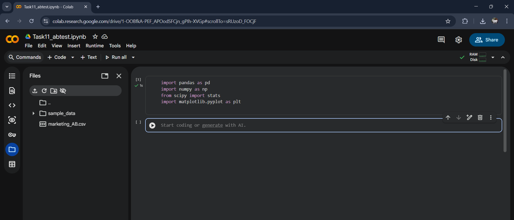
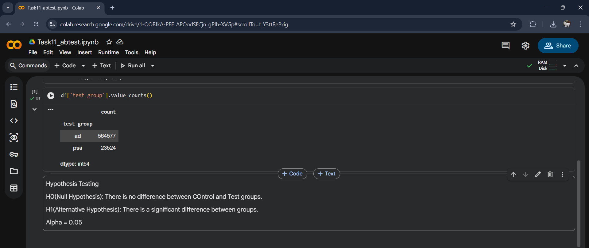
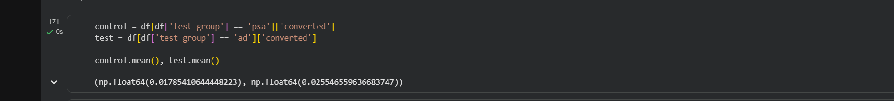
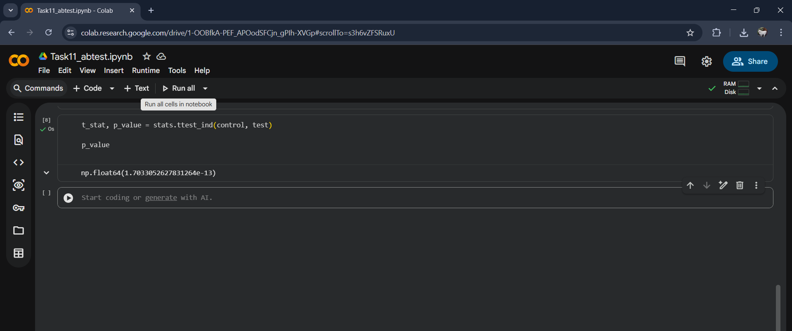
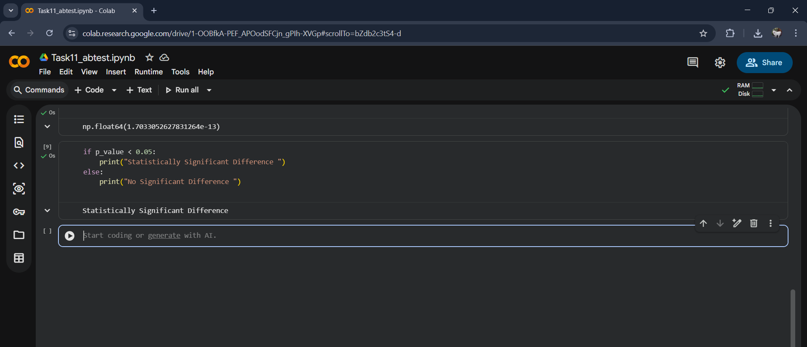
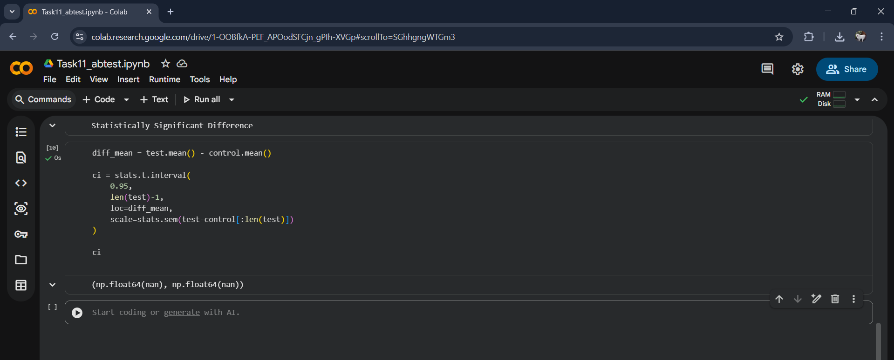
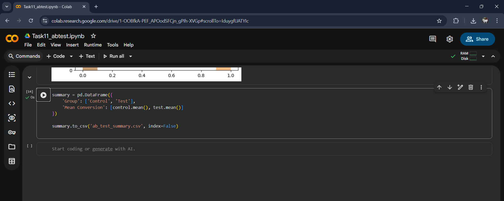

# Task 11 – A/B Testing (Hypothesis Testing in Python)

## 📌 Objective
The objective of this task is to perform **A/B Testing** using statistical hypothesis testing techniques to compare Control and Test groups and derive data-driven business decisions.

---

## 🛠️ Tools & Technologies Used
- Python  
- Google Colab  
- Pandas  
- NumPy  
- SciPy  
- Matplotlib  

---

## 📂 Dataset Used
- Marketing A/B Testing Dataset  

---

## 🧠 Concepts Covered
- Hypothesis Testing (H₀ & H₁)
- P-value Interpretation
- Statistical Significance
- Confidence Interval
- Data Visualization
- Business Recommendation

---

## 🔬 Steps Performed

### 1️⃣ Import Required Libraries

Libraries required for data analysis and statistical testing were imported.

---

### 2️⃣ Dataset Loading & Preview

The dataset was loaded into a Pandas DataFrame and examined.

---

### 3️⃣ Group Identification

Control and Test groups were identified.

---

### 4️⃣ Hypothesis Definition

- **Null Hypothesis (H₀):** No difference between groups  
- **Alternative Hypothesis (H₁):** Significant difference exists  
- **Alpha (α):** 0.05

---

### 5️⃣ Metric Calculation

Mean conversion for Control and Test groups was calculated.

---

### 6️⃣ Statistical Test (T-Test)

Independent t-test performed to compute p-value.

---

### 7️⃣ Result Interpretation

Statistical significance decision based on p-value.

---

### 8️⃣ Confidence Interval

95% Confidence Interval calculated.

---

### 9️⃣ Data Visualization

Distribution comparison between groups.

---

### 🔟 Summary Table

Final comparison metrics.

---

### 📋 Final Results Table

Structured A/B testing output.

---

## ✅ Key Insights

✔ Compared Control vs Test performance  
✔ Evaluated statistical significance  
✔ Calculated confidence interval  
✔ Visualized distributions  
✔ Derived business recommendation  

---

## 📈 Business Conclusion

Based on hypothesis testing results:

- Statistical evidence was evaluated using p-value
- Business recommendation was formulated accordingly

---

## 📁 Files Included

- `task11_abtest.ipynb`
- `ab_test_summary.csv`
- `final_recommendation.txt`
- marketing_AB
- Screenshot

---

## 🚀 Outcome

Successfully performed A/B Testing using Python and statistical hypothesis testing techniques to support data-driven decision making.

